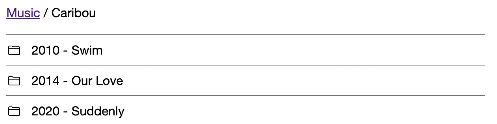
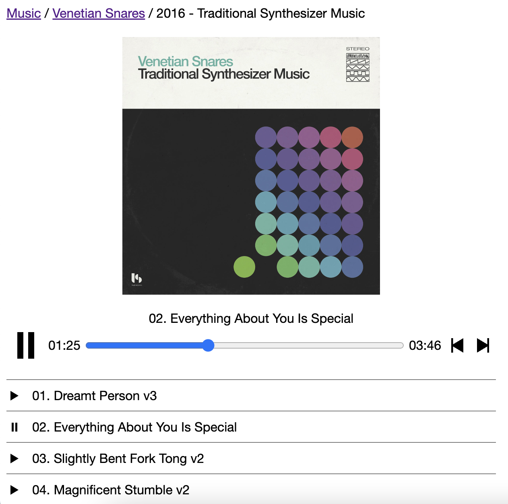

# Bsimp

Bsimp is a minimalistic S3-backed audio library. It lets you play audio files from an S3 bucket with any arbitrary directory structure.

It works with AWS S3 or any S3 API compatible storage such as DigitalOcean Spaces, Backblaze B2, Cloudflare R2 or MinIO.

## Why

Over the years I acquired a large library of audio files from different sources - Bandcamp, Google Music and I even ripped some CDs myself a decade ago. I wanted a way to listen my audio files from different devices and also have them backed up reliably on cloud storage. S3 solves both of these problems - it serves as a live audio library and as a backup at the same time.

I didn't want to go with the existing [open source](https://github.com/awesome-selfhosted/awesome-selfhosted#media-streaming---audio-streaming) audio streaming services. I found them resource-heavy, having many dependencies and features I would never use.

## Features

- Cover art support
- Responsive design
- Stateless - no database required

## Screenshots

Directory Browser



Audio Player



## Configuring

DigitalOcean Spaces config example:

```toml
[s3]
region = "nyc3"
endpoint = "https://nyc3.digitaloceanspaces.com"
bucket = "foo"

[s3.credentials]
id = "SPACES KEY"
secret = "SPACES SECRET"
```

MinIO config example:
```toml
[s3]
region = "local"
endpoint = "http://localhost:9000"
bucket = "music"
force_path_style = true

[s3.credentials]
id = "minioadmin" 
secret = "minioadmin"
```

## Running

```sh
bsimp -config=/etc/bsimp/config.toml -http=":8080"
```

## Security

Bsimp doesn't have built-in authentication or rate-limiting. The server should never be exposed to the Internet directly to avoid unexpected S3 bills.

When exposed to the Internet, the server should run behind a full-fledged web server like Nginx with the following features enabled:
- HTTPS
- Authentication
- Rate Limiting

## FAQ

### What audio formats does it support?

All audio formats [supported](https://caniuse.com/?search=audio%20format) by the web browser.

### Is there a mobile app?

No, but the web interface works well on mobile phones. The Media Session API lets you control the playback from the notification bar or the lock screen.

### Does it support playlists?

No, Bsimp follows the S3 bucket directory structure.

### Does it support transcoding?

No, audio files are streamed as is.
